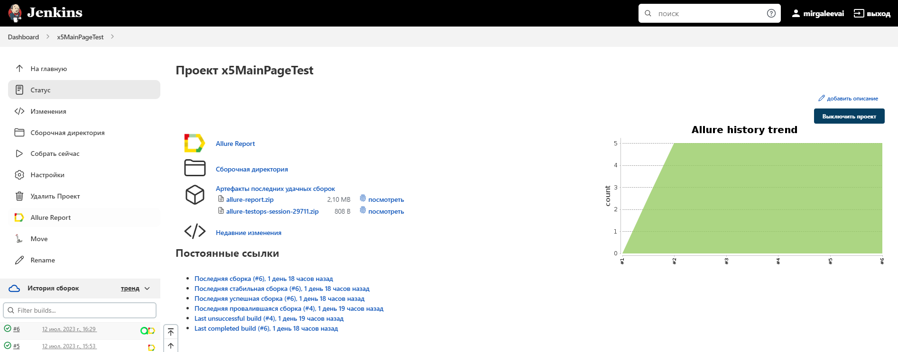
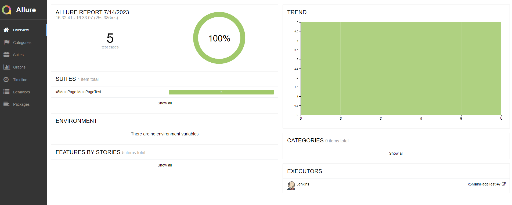
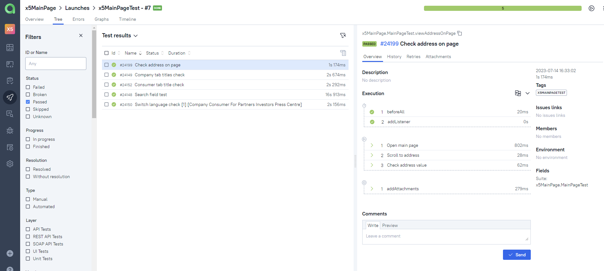
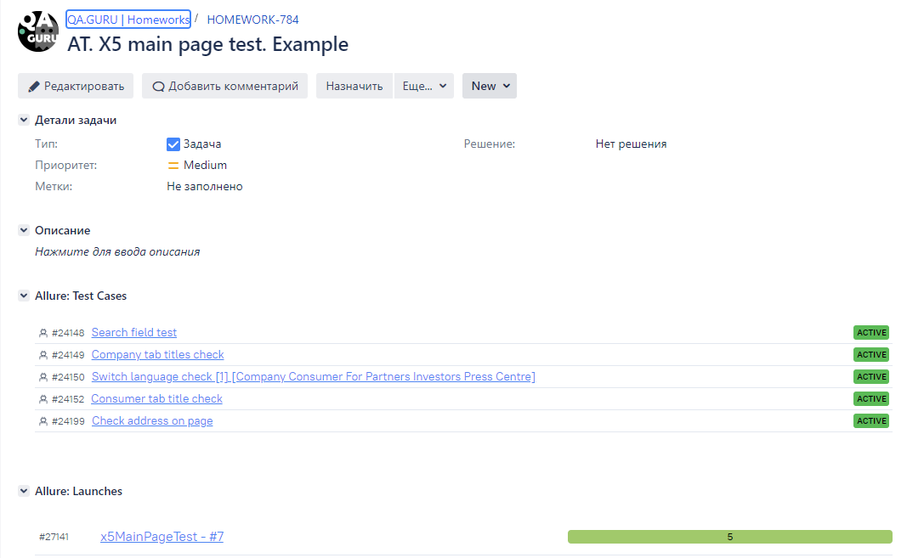
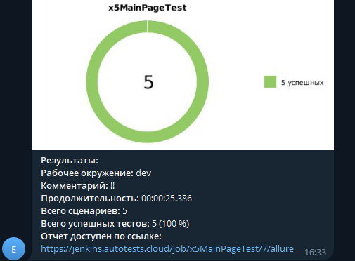

# x5Group пример автотестов
<p align="center">


</p>

### Запуск из терминала
```
gradle clean test -Denv=local  - локальный запуск
```
```
gradle clean test -Denv=remote - удаленный запуск
```

##  Jenkins
<p align="center">

</p>

##  Allure-отчет
### Overview

<p align="center">

</p>

##  Allure TestOps

<p align="center">

</p>

##  Jira

<p align="center">

</p>

##  Отправка уведомления в Telegram

<p align="center">

</p>

## Видео пример запуска тестов в Selenoid

<p align="center">
  
</p>
